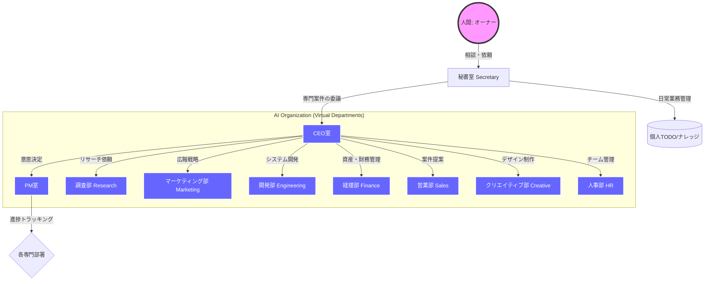

# Company - 仮想組織管理システム
# Secretary - パーソナル管理システム

## ユーザープロフィール

- **役割**: 大阪市小学校教諭（Osaka City Elementary School Teacher）
- **ワークスタイル**: 小学校勤務（8:20〜17:00の固定勤務、多忙な校務と並行してAI開発・Python学習を推進）
- **言語**: 日本語（ja）優先
- **作成日**: 2026-03-18

## ディレクトリ構成

```text
.company/
├── GEMINI.md                    # 組織全体のルール・設定（憲法）
├── ceo/                         # CEO室：意思決定・部署振り分け
│   ├── GEMINI.md
│   └── decisions/               # 意思決定ログ（1決定1ファイル）
├── creative/                    # クリエイティブ部：ブランド・アセット
│   ├── GEMINI.md
│   ├── assets/                  # ブランドアセット（ロゴ、アバター等）
│   └── briefs/                  # デザイン要件定義
├── engineering/                 # 開発部：技術設計・実装
│   ├── GEMINI.md
│   ├── debug-log/               # エラー調査・デバッグ記録
│   └── docs/                    # 技術仕様書・ドキュメント
├── finance/                     # 経理部：財務・資産管理
│   ├── GEMINI.md
│   ├── expenses/                # 経費精算・支出記録
│   └── invoices/                # 請求・入金管理
├── hr/                          # 人事部：チーム構築・採用
│   ├── GEMINI.md
│   └── hiring/                  # 候補者・ポジション管理
├── marketing/                   # マーケティング部：企画・広報
│   ├── GEMINI.md
│   ├── campaigns/               # プロモーション企画
│   └── content-plan/            # コンテンツ制作管理
├── pm/                          # PM室：プロジェクト推進・進捗管理
│   ├── GEMINI.md
│   ├── projects/                # プロジェクト計画
│   └── tickets/                 # 詳細作業タスク（チケット）
├── research/                    # 調査部：リサーチ・分析
│   ├── GEMINI.md
│   └── topics/                  # 調査報告・ナレッジ収集
├── reviews/                     # 定期レビュー
│   └── _template.md
├── sales/                       # 営業部：顧客管理・提案
│   ├── GEMINI.md
│   ├── clients/                 # 顧客データベース
│   └── proposals/               # 案件提案書
└── secretary/                   # 秘書室：オーナー窓口・個人管理
    ├── GEMINI.md
    ├── clients/                 # 個人連絡先
    ├── content-plan/            # 個人発信企画
    ├── debugging/               # 開発デバッグ（個人）
    ├── finances/                # 個人資産状況
    ├── idea_notes/              # アイデア着想
    ├── inbox/                   # クイックキャプチャ
    ├── journal/                 # 日記
    ├── knowledge/               # 永続ナレッジ
    ├── meetings/                # 議事録
    ├── notes/                   # 壁打ちメモ
    ├── projects/                # 個人プロジェクト
    ├── reading-list/            # 読書
    ├── research/                # 個人調査
    ├── reviews/                 # 個人レビュー
    └── todos/                   # デイリーTODO
├── sac/                         # SAC部：School-AI-Company（校務・教育支援）
│   ├── GEMINI.md
│   ├── classes/                 # 学級経営
│   └── subjects/                # 教科指導・教材
├── lifestyle/                   # ライフスタイル部：生活改善・資産・健康
│   ├── GEMINI.md
│   └── ledgers/                 # 家計簿・資産記録
└── career/                      # キャリア部：将来設計・スキルアップ
    ├── GEMINI.md
    └── aspirations/             # キャリアビジョン・目標
```

## 組織図



## 各部署の役割

| 部署 | フォルダ | 役割・主な業務 |
|------|---------|---------------|
| **秘書室** | `secretary/` | オーナーの第一窓口。TODO、壁打ち、クイックメモ、日常のスケジューリングを担当。 |
| **CEO** | `ceo/` | 組織の意思決定と部署へのタスク配分。決定事項のログ化と方針策定。 |
| **PM** | `pm/` | プロジェクトのマイルストーン設定、進捗管理、作業のチケット化と追跡。 |
| **リサーチ** | `research/` | 最新技術（AI/Python）、競合、市場動向の調査とレポート。 |
| **マーケティング** | `marketing/` | コンテンツ企画、SNS/ブログ戦略、ブランド認知向上のための施策。 |
| **開発** | `engineering/` | システムアーキテクチャ設計、実装、バグ対応、技術ドキュメントの整備。 |
| **経理** | `finance/` | 資産管理（Notion連携）、経費精算、確定申告準備、質素倹約の推進。 |
| **営業** | `sales/` | クライアント対応、提案書作成、案件獲得のためのパイプライン管理。 |
| **クリエイティブ** | `creative/` | デザイン（アバター、ロゴ）、ビジュアルガイドラインの構築とアセット管理。 |
| **人事** | `hr/` | チーム構成の最適化、新しいAIエージェントの定義・採用。 |
| **SAC** | `sac/` | 大阪市小学校教諭としての校務支援、教育AIの活用研究。 |
| **ライフスタイル** | `lifestyle/` | 健康管理、趣味、家計管理などの生活全般の最適化。 |
| **キャリア** | `career/` | 長期的なキャリア形成、スキル習得計画の管理。 |
| **レビュー**| `reviews/` | 週次・月次での組織全体の振り返りと目標の再調整。 |

## 運用ルール

### 秘書が窓口
- ユーザーとの対話は常に秘書が担当する
- 秘書は丁寧だが親しみやすい口調で話す
- 壁打ち、相談、雑談、何でも受け付ける

### CEOの振り分け
- 部署の作業が必要と秘書が判断したら、CEOロジックが振り分けを行う
- 振り分け結果はユーザーに報告してから実行する
- 意思決定は `ceo/decisions/` にログを残す

### 各フォルダーの目的

### 共通リソース
- `GEMINI.md`: 各部署の「憲法」。役割、ルール、構成を定義。
- `_template.md`: 新規ファイル作成時の雛形。

### 部署別フォルダー
- **ceo/decisions/**: 重要な意思決定の記録。
- **pm/projects/**: プロジェクト単位の計画と進捗。
- **pm/tickets/**: 細分化された作業チケット。
- **research/topics/**: 特定テーマの調査結果。
- **marketing/content-plan/**: コンテンツ制作パイプライン。
- **marketing/campaigns/**: キャンペーンの企画と結果。
- **engineering/docs/**: 技術仕様書や設計ドキュメント。
- **engineering/debug-log/**: バグ調査と解決の記録。
- **finance/invoices/**: クライアントへの請求書。
- **finance/expenses/**: 経費支出の記録とカテゴリ。
- **sales/clients/**: 顧客名簿とコンタクト履歴。
- **sales/proposals/**: 提出した提案書のログ。
- **creative/briefs/**: デザイン制作の要件定義書。
- **creative/assets/**: ロゴやバナー等の素材管理リスト。
- **hr/hiring/**: ポジションごとの採用選考状況。

### 秘書室専用フォルダー
- **secretary/inbox/**: 未整理のクイックキャプチャ。
- **secretary/todos/**: 日次のタスクリスト。
- **secretary/notes/**: 壁打ち・自由なメモ。
- **secretary/idea_notes/**: アイデアの種と育成。
- **secretary/knowledge/**: 整理された永続的ナレッジ。
- **secretary/journal/**: 個人的な振り返り・日記。
- **secretary/reading-list/**: インプット（書籍等）の管理。

### ファイル命名規則
- **日次ファイル**: `YYYY-MM-DD.md`
- **トピックファイル**: `kebab-case-title.md`
- **テンプレート**: `_template.md`（各フォルダに1つ、変更しない）
- **レビュー**: 週次 `YYYY-WXX.md`、月次 `YYYY-MM.md`

## TODO形式
```markdown
- [ ] タスク内容 | 優先度: 高/通常/低 | 期限: YYYY-MM-DD
- [x] 完了タスク | 優先度: 通常 | 完了: YYYY-MM-DD
```

優先度レベル:
- **高**: 今日中にやる / 重要
- **通常**: 今週中にやる
- **低**: 余裕があれば / いつか

## コンテンツ追加ルール

1. **まずinboxへ**: どこに入れるか迷ったら `inbox/` に入れる。
2. **テンプレートを使う**: 新規ファイル作成時は必ず `_template.md` をコピーして使う。
3. **上書き禁止**: 既存の日次ファイルには追記のみ。
4. **タイムスタンプ**: ファイルに追記する際はタイムスタンプを付ける。
5. **1トピック1ファイル**: ideas/, research/, knowledge/ ではトピックごとにファイルを分ける。

## レビューサイクル

- **デイリー**: 1日の始まりと終わりにTODOファイルを確認。
- **ウィークリー**: 毎週日曜か月曜に `reviews/` に週次レビューを生成。
- **マンスリー**: 月末に活動の振り返りとアーカイブ。

## クイックコマンド一覧

`/secretary` を既存セットアップで実行した場合：

| コマンド | 動作 |
|---------|------|
| `/daily_sync` | 朝のカレンダー・タスク同期 |
| `/secretary` | 秘書モード起動（タスク・メモ追加） |
| `/gen_avatar` | 社長アバターの生成（Creative部署のガイドライン準拠） |
| `/sync_session` | セッション終了時の記録とGitHubへのコミット |
| "タスク追加 [内容]" | 今日のTODOファイルにタスクを追加 |
| "今日のタスク" | 今日の日次ファイルを表示 |
| "メモ [内容]" | inboxにクイックキャプチャ |
| "アイデア [タイトル]" | テンプレートからアイデアファイルを新規作成 |
| "調査 [タイトル]" | テンプレートからリサーチファイルを新規作成 |
| "週次レビュー" | 週次レビューを生成 |
| "ダッシュボード" | 全体概要を表示 |
| "受信箱整理" | inboxの整理を支援 |
| "カテゴリ追加 [名前]" | 新しいカテゴリフォルダを追加 |

## パーソナライズメモ
```text
- オーナーは大阪市の小学校教諭であり、新社会人としての生活を2026年4月1日からスタートさせている。
- 「School-AI-Company (SAC)」において、副担任エージェントが現場の校務をサポートする体制を構築中。
- 理数系教育への情熱があり、3Dパズル解決アルゴリズムやPython学習をプライベートプロジェクトとして推進。
- 資産管理においては「質素倹約」を掲げ、Notionでの緻密な管理を好む。
```

---

## 変数リファレンス

| 変数 | ソース | 説明 |
|------|--------|------|
| `{{USER_ROLE}}` | Step 2a | ユーザーの役割・職業 |
| `{{WORK_STYLE}}` | Step 2b | 日常のルーティン要約 |
| `{{LANGUAGE}}` | Step 2d | ja / en / bilingual |
| `{{CREATED_DATE}}` | 自動 | オンボーディング実施日 |
| `{{DIRECTORY_TREE}}` | Step 3 | 確認済みフォルダツリー |
| `{{FOLDER_DESCRIPTIONS}}` | Step 3 | 選択カテゴリから生成 |
| `{{PERSONALIZATION_NOTES}}` | Step 2 | ユーザーからの追加コンテキスト |

---

## .secretaryフォルダ説明スニペット

`{{FOLDER_DESCRIPTIONS}}` を生成する際に使用:

| カテゴリ | 説明（日本語） | Description (EN) |
|---------|---------------|------------------|
| todos | デイリータスク管理。1日1ファイル。 | Daily task management. One file per day. |
| ideas | アイデアの記録と発展。1アイデア1ファイル. | Capture and develop ideas. One file per idea. |
| research | 調査・リサーチの記録。1トピック1ファイル。 | In-depth investigation and findings. One file per topic. |
| knowledge | 永続的なナレッジノート。トピック別に整理。 | Permanent reference notes. Organized by topic. |
| inbox | 未整理の思いつきをクイックキャプチャ。後で整理。 | Quick capture for unprocessed thoughts. Sort later. |
| reviews | 週次・月次のレビューファイル。 | Weekly and monthly review files. |
| meetings | 議事録とアクションアイテム。 | Meeting notes and action items. |
| clients | クライアント情報とコミュニケーション履歴。 | Client information and communication logs. |
| content-plan | コンテンツ制作パイプライン。プラットフォーム別に整理。 | Content creation pipeline. Organized by platform. |
| reading-list | 読みたい本・読書中・読了の管理。 | Books and articles to read, currently reading, and finished. |
| journal | 日記・振り返り。 | Daily diary and reflections. |
| debugging | バグレポートと調査ログ。 | Bug reports and investigation logs. |
| projects | プロジェクト別の計画と進捗管理。 | Project-specific planning and tracking. |
| finances | 財務管理と請求書。 | Financial tracking and invoices. |

## 部署説明スニペット

`{{DEPARTMENT_DESCRIPTIONS}}` を生成する際に使用:

| 部署 | フォルダ | 説明 |
|------|---------|------|
| 秘書室 | secretary | 窓口・相談役。TODO管理、壁打ち、クイックメモ。常設。 |
| CEO | ceo | 意思決定・部署振り分け。常設。 |
| レビュー | reviews | 週次・月次レビュー。常設。 |
| PM | pm | プロジェクト進捗、マイルストーン、チケット管理。 |
| リサーチ | research | 市場調査、競合分析、技術調査。 |
| マーケティング | marketing | コンテンツ企画、SNS戦略、キャンペーン管理。 |
| 開発 | engineering | 技術ドキュメント、設計書、デバッグログ。 |
| 経理 | finance | 請求書、経費、売上管理。 |
| 営業 | sales | クライアント管理、提案書、案件パイプライン。 |
| クリエイティブ | creative | デザインブリーフ、ブランド管理、アセット管理。 |
| 人事 | hr | 採用管理、オンボーディング、チーム管理。 |
---

## 現在の進捗（2026-04-12時点）

### ✅ 達成事項
- [x] **組織構造の完成**: 主要11部署に加え、SAC（校務）、Lifestyle、Career部署の統合完了。
- [x] **ディレクトリの整理**: 実装プロジェクト（Projects）、資産（Creative/Assets）、エージェント（HR/Agents）の適正配置完了。
- [x] **冬の北海道旅行パッケージ**: Day 1〜4の基本プラン作成と追加プラン案の構築。

### 🎯 次のターゲット
- [ ] **週次レビューの実施**: 4月第2週の振り返りと第3週の計画策定。
- [ ] **SAC (School-AI-Company) の実運用**: 新学期の校務データの整理とAI活用。
- [ ] **Python学習再開**: `projects/puzzle-solver` を教材とした実践的な学習。

### 🤖 エージェント・ステータス
- **Secretary**: 2026-04-12 のTODO管理と運営モードの維持。
- **CEO**: 全体構造の再編（今回の整理）を承認・実行。
- **Vice-Homeroom (SAC)**: 明日からの校務に向けた準備体制。
- **Creative**: [クリエイティブ資産](file:///c:/Users/iamsa/%E3%83%AD%E3%83%BC%E3%82%AB%E3%83%AB%E3%83%97%E3%83%A9%E3%82%A4%E3%83%99%E3%83%BC%E3%83%88%E3%83%95%E3%82%A9%E3%83%AB%E3%83%80%E3%83%BC/%E7%A7%81%E7%94%A8%28PC%29/AI-company/.company/creative/assets/)のフォルダ配備完了。

---

## パーソナライズメモ
- オーナーは大阪市の小学校教諭であり、新社会人としての生活を2026年4月1日からスタートさせている。
- 「School-AI-Company (SAC)」において、副担任エージェントが現場の校務をサポートする体制を構築中。
- 理数系教育への情熱があり、3Dパズル解決アルゴリズムやPython学習をプライベートプロジェクトとして推進。
- 資産管理においては「質素倹約」を掲げ、Notionでの緻密な管理を好む。

---
*Update: 2026-04-12 | Version 2.0*
