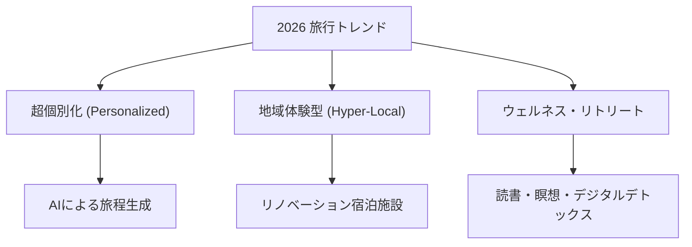

# 旅行パッケージ市場調査報告 2026

## ステータス: ==completed==
- **作成日**: 2026-03-24
- **担当部署**: リサーチ
- **トピックID**: `travel-package-market-2026`

---

## 1. 調査概要
JTB、日本旅行、東海ツアーズ（JR東海ツアーズ）をはじめとする日本の大手旅行会社が2025年〜2026年に提供している主要な旅行パッケージ、および市場トレンドを調査し、「パッケージ化された情報」として整理した。

## 2. 主要プレイヤー分析 (Comparison Matrix)

| 旅行会社 | 主要パッケージ | 強み・特徴 | ターゲット |
| :--- | :--- | :--- | :--- |
| **JTB** | ダイナミックパッケージ (My STYLE) | 航空・JRの選択肢が膨大、JTBトラベルポイントの還元、海外サポートの厚さ | 幅広い層（家族、ビジネス、富裕層） |
| **日本旅行** | 赤い風船 ダイナミックパッケージ | 国内外のトータルサポート、初心者向けのきめ細やかな旅程案内、USJ提携 | ファミリー、海外旅行初心者 |
| **東海ツアーズ** | EX旅パック (ダイナミック/こだわり) | 新幹線＋ホテルの圧倒的低価格、出発直前の予約・変更が可能、スマートEX連携 | 出張者、カップル、価格重視の中高年 |

### 特筆すべきサービス: 「ずらし旅」 (JR東海)
混雑を避け、特典（体験クーポン）を付与することで、旅行者の満足度と地域貢献を両立させる「オフピーク旅行」をパッケージ化。

## 3. 2026年の旅行トレンド (Market Trends)

### キーワード分析
1. **スポーツ観光**: 2026年はスポーツ観戦を目的とした滞在パッケージ（相撲、ラグビー等）が伸長。
2. **ロケ地巡り**: 長期的な人気を博しており、ドラマや映画の舞台を「パッケージ化」した巡礼ツアーが定番化。
3. **ホテルホッピング**: 1つの都市で2種類以上のコンセプトホテルに泊まる「体験の多様化」が人気。

## 4. パッケージ化された知見 (Structured Insights)

旅行会社各社の提供価値を再定義すると以下の「パッケージ構成要素」に集約される。

### A. 交通・宿泊統合パッケージ
- **ダイナミックプライシング**: 需要に合わせたリアルタイム価格。
- **直前予約機能**: 出発24時間前まで確定可能な柔軟性。

### B. コンテンツ付加価値パッケージ
- **体験クーポン**: 地元飲食店やアクティビティをセット。
- **テーマ特化**: 「推し活」「聖地巡礼」など、特定の文脈を持たせた構成。

## 5. 結論
2026年の旅行パッケージ市場は、**「単純な移動＋宿泊」から「個人の価値観に基づいたストーリーの提供」**へと昇華されている。大手各社はダイナミックパッケージ等のIT基盤を盤石にしつつ、地方創生や体験価値というコンテンツ面での差別化を強めている。

## 6. ネクストアクション
- [ ] 調査した各社の具体的なプラン内容をデータベース（Notion等）へ移植。
- [ ] 今後の自社プロジェクト（旅行系アプリ等）に、今回得た「超個別化」と「ずらし旅」のエッセンスを反映させる設計書を作成。
- [ ] 競合の価格変動をモニタリングするスクリプトの検討。

---

## 7. 情報源 (Sources)
- JTB公式: [https://www.jtb.co.jp/](https://www.jtb.co.jp/)
- 日本旅行公式: [https://www.nta.co.jp/](https://www.nta.co.jp/)
- JR東海ツアーズ公式: [https://www.jrtours.co.jp/](https://www.jrtours.co.jp/)
- 2026年旅行市場見通し (JTB総研): [https://www.jtbcorp.jp/](https://www.jtbcorp.jp/)
- エクスペディア・トラベルトレンド報告書2026
