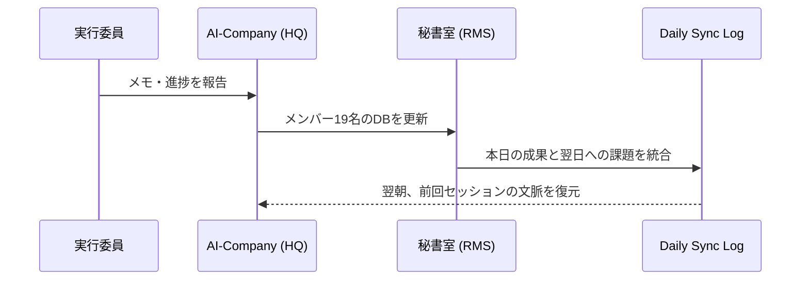

# 🚀 特別演習: 次世代のチーム管理と AI エージェントの自律
**対象**: 大学祭実行委員会 幹部 / フロントエンド開発チーム
**作成者**: SAC (School-AI-Company) Lead Educator
**日付**: 2026-04-05

---

> [!IMPORTANT]
> **【導入: Trend Hook】**
> 先日、三菱UFJキャピタルなどの大手VCが、これまでの投資案件の発掘・審査の業務を人間から「AIエージェント」へと段階的に移行させるというニュースが世界を駆け巡りました。
> これは、AIが単に「質問に答えるツール」から、自ら意思決定し「働くパートナー（Agent）」になったことを意味します。
>
> 私たちの大学祭実行委員会（19名）の管理も、従来のExcel管理から、AIエージェントによる **「自律的リレーション管理 (RMS)」** への転換点が来ています。

---

## 🧩 演習課題 (Thinking Challenge)

### 【Q1】エージェントによる意思決定の評価
あなたは19名のメンバーのシフト調整とタスク進捗管理を、AIエージェント（Antigravity）に完全に任せることにしました。
エージェントは過去のメンバーの活動ログ、個人のTODO、さらに「性格の相性（バッファ領域への蓄積データ）」を分析し、最適なチーム編成を提案しました。

**設問**:
あなたが「エージェントの提案をそのまま採用する」のではなく、**「人間（リーダー）として最後の一押し（介入）」** を行うべき状況は、以下のうちどれが最も適切ですか？ その理由とともに回答してください。

A) 特定のメンバーが、過去のログにはない「急な体調不良」を訴えたとき
B) AIが「効率は最大だが、人間関係の摩擦（以前のトラブル）を無視した」編成を提案したとき
C) 締め切りまで時間がないため、AIが「最も残業が可能なメンバー」にタスクを集中させたとき

---

### 【Q2】システム・アーキテクチャの解析
以下は、実行委員会のメンバー管理を自動化する AI-Company の簡易的なシーケンス図です。
このフローにおいて、**「情報の断片化」を防ぐために最も重要な楔（くさび）** となっているステップはどこですか？

---

### 【Q3】創造的介入 (Creative Creation)
AIエージェントが「19名のメンバー全員のモチベーションが低下している」と分析しました。
あなたは、これまでの「タスク管理」という合理的なアプローチを超えた、**「彩人さんの美学（Aesthetics）」** を取り入れた解決策を一つ提案してください。
（例：デザインの一新、共通の目標の再定義、予想外のリフレッシュなど）

---

## 💡 解説: Meaningful Insights

### 考えるヒント
1. **【Q1の解説】**: 正解は **B** です。AIは「効率（Efficiency）」を最大化するのが得意ですが、人間の「感情（Vibe）」の機微までは完全に予測できません。リーダーの役割は、AIが算出した「論理的な正解」に、血の通った「感情の整合性」を上書きすることにあります。
2. **【Q2の解説】**: 最も重要なのは **「Sync -->> HQ」** のステップ、つまり **「Context Restoration（文脈復元）」** です。これがなければ、AIは毎朝「初対面の新人」に戻ってしまいます。「昨日の続きを知っている部下」であってこそ、エージェントは真の力を発揮します。
3. **【Q3の解説】**: ここに正解はありません。しかし、彩人さんが大切にしている「Wow」を与える体験、例えば **「メンバー全員のアバター(GenAvatar)を一新して、共通のアイデンティティを再確認する」** といった、一見非効率に見えて「誇り」を取り戻すようなアプローチこそが、AIにはできない真のマネジメントです。

---
*Stay Human. Stay Creative. Powered by SAC.*
