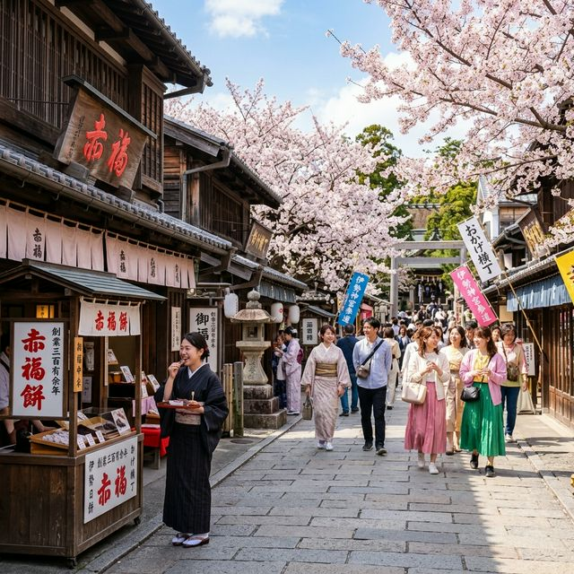

# 春の伊勢志摩旅行パッケージ

## 概要
- **基本の日数**: 日帰り（弾丸）
- **追加プラン (+n日)**: 鳥羽周辺（水族館・夫婦岩）を巡り、温泉宿に宿泊 (+1日)

## タイムライン（基本：日帰り）
### Day 1: 伊勢神宮参拝とおかげ横丁
- [ ] 09:14 鶴橋駅出発（近鉄特急・賢島ゆき）
- [ ] 11:00 五十鈴川駅到着、バスで内宮方面へ移動
- [ ] 12:00 おかげ横丁でランチ（伊勢うどん、手こね寿司など）
- [ ] 13:30 伊勢神宮 内宮を参拝（日本最上位のパワースポット）
- [ ] 15:00 おかげ横丁・内宮周辺で食べ歩き（赤福本店、豚捨、山村みるく等）
- [ ] 16:30 猿田彦神社参拝または周辺散策
- [ ] 19:27 五十鈴川駅出発（ビスタカー・階上席でゆったり）
- [ ] 21:20 鶴橋駅到着

## 追加オプション (+1日)
### Day 2: 鳥羽観光と絶景
- [ ] 10:00 伊勢シーパラダイスでセイウチとふれあい
- [ ] 12:00 夫婦岩（縁結びのシンボル）観光
- [ ] 14:00 鳥羽水族館（日本一の飼育種類数）

## 持ち物・準備
- [ ] 近鉄株主優待券・特急券（事前予約推奨）
- [ ] 御朱印帳（伊勢神宮用）
- [ ] 小銭（お賽銭用）
- [ ] モバイルバッテリー

## 現実逃避ポイント（癒やし・驚き）
- 伊勢神宮 内宮の静謐で清らかな空気感。
- おかげ横丁の活気ある江戸時代の街並みと絶品グルメ。
- 帰りのビスタカー階上席から眺める車窓の風景（大人の遠足感）。
