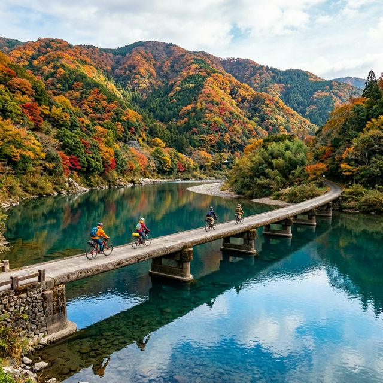

# 秋の高知・四万十川キャンプ旅2泊3日

## 概要
- **基本の日数**: 2泊3日
- **追加プラン (+n日)**: 桂浜や高知市内「ひろめ市場」でカツオの叩きを極める (+1日)

## タイムライン（基本：2泊3日）
### Day 1: 四万十到着・廃校キャンプ開始
- [ ] 11:00 高知市内からレンタカーで四万十方面へ。
- [ ] 13:00 四万十川到着。沈下橋（佐田沈下橋など）で記念撮影。
- [ ] 15:00 廃校舎を利活用した宿泊施設（四万十学舎など）にチェックイン。
- [ ] 17:00 体育館でガチのドッジボール大会（動画の再現）。
- [ ] 19:00 BBQ開始。地元の食材、四万十ポークや川魚を堪能。

### Day 2: 川遊びとカヌー体験
- [ ] 09:00 四万十川でカヌー、または屋形船体験。日本最後の清流を肌で感じる。
- [ ] 12:00 道の駅 四万十とおわで「四万十地栗」スイーツやランチ。
- [ ] 14:00 サイクリングで周辺の沈下橋巡り。
- [ ] 18:00 宿泊先に戻り、五右衛門風呂や星空観測。

### Day 3: 高知市内観光と帰路
- [ ] 09:00 チェックアウト。高知市内へ戻る。
- [ ] 11:30 ひろめ市場で「カツオのたたき（塩）」を食す。
- [ ] 13:30 高知城、または桂浜の坂本龍馬像を見学。
- [ ] 15:00 高知龍馬空港より帰路へ。

## 追加オプション (+1日)
### Day 4: 仁淀ブルーを訪ねて
- [ ] 仁淀川へ移動。「仁淀ブルー」と呼ばれる驚異の透明度を体験。
- [ ] にこ淵、安居渓谷での滝巡り。

## 持ち物・準備
- [ ] キャンプ用品（レンタルも可）
- [ ] 川遊び用の着替え・サンダル
- [ ] 虫除けスプレー
- [ ] 勇気（ドッジボールや川遊び用）

## 現実逃避ポイント（癒やし・驚き）
- 欄干のない沈下橋を渡る、少しのスリルと圧倒的な開放感。
- 夜の四万十で眺める、降るような星空。
- 廃校というノスタルジックな空間で、童心に帰って遊ぶ時間。
