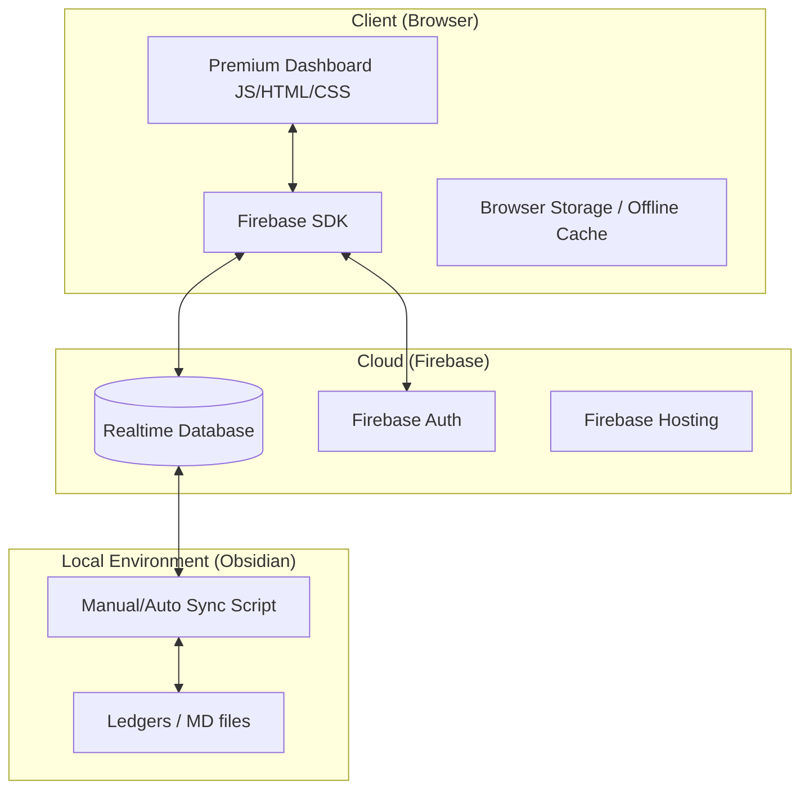

# 💎 Finance Dash v2 (Cloud Native) 設計図

本プロジェクトは、従来のローカルサーバー依存型から、**Firebase Realtime Database (RTDB)** を中核としたサーバーレス・プレミアムダッシュボードへと進化します。

---

## 1. システム構成案 (Architecture)



---

## 2. データベース設計 (Firebase RTDB スキーマ)

データは階層構造で管理し、スケーラビリティと高速なアクセスを両立させます。

```json
{
  "users": {
    "{uid}": {
      "profile": { "name": "彩人", "last_login": "timestamp" },
      "assets": {
        "summary": { "total": 1254300, "last_updated": "timestamp" },
        "allocation": { "cash": 800000, "investment": 454300 }
      },
      "gamification": {
        "act_points": 2450,
        "level": 12,
        "badges": ["early_adopter", "fin_master"]
      }
    }
  },
  "history": {
    "{uid}": {
      "{year}": {
        "{month}": {
          "records": [
            { "id": "uuid", "type": "expense", "amount": 1200, "category": "食費", "date": "2026-05-01" },
            { "id": "uuid", "type": "income", "amount": 200000, "category": "給与", "date": "2026-04-30" }
          ]
        }
      }
    }
  },
  "audit": {
    "{uid}": {
      "salaries": [
        { "month": "2026-04", "base": 200000, "tax": 30000, "net": 170000 }
      ]
    }
  }
}
```

---

## 3. 主要機能モジュール

### 3.1 プレミアム・ダッシュボード (Main)
- **Glassmorphism UI**: 背景のブラー効果、微細なグラデーション、アニメーション。
- **Realtime Chart**: 資産推移を `Chart.js` で描画。Firebase の変更を検知して即座に反映。
- **Safe-to-Spend**: 「今月の残高 - 固定費 - 貯金目標」から、今日使える金額をリアルタイム算出。

### 3.2 ACT (AI-Company Token) システム
- **価値の可視化**: 開発ログや TODO 完了数を「ACT ポイント」として資産の一部としてカウント。
- **ロジック**: セッション時間の長さや成果物の数に基づき、Firebase 上のポイントを加算。

### 3.3 給与監査 (Salary Audit)
- **詳細ログ**: 教諭としての特殊な手当（義務教育等教員特別手当など）を網羅。
- **異常検知**: 規定の給与体系から外れた場合にアラートを表示。

---

## 4. データ移行プラン

1.  **JSON Export**: 現行の `finance_db.json` を Firebase が受け入れ可能な JSON 形式へ変換。
2.  **Firebase Import**: Firebase Console または CLI を使用して RTDB へ流し込み。
3.  **Local Sync**: Obsidian 側の `ledgers/*.md` と RTDB の整合性を保つための軽量スクリプトの作成。

---

## 5. 開発ロードマップ (Step-by-Step)

1.  **[Infrastructure]**: Firebase プロジェクトの復活と初期設定（API Key, RTDB 起動）。
2.  **[Core Logic]**: `main.js` を `firebase-sdk` ベースに書き換え、データ取得・送信を非同期化。
3.  **[UI Refine]**: エントリー（入力）画面に「電卓風入力」と「音声入力（将来用）」の枠組みを追加。
4.  **[Module Add]**: ACT システムと給与監査画面の実装。
5.  **[Deployment]**: Firebase Hosting へデプロイし、モバイル（Pixel 9）からもアクセス可能にする。

---
> [!IMPORTANT]
> **次のアクション**:
> ユーザー様側で、[Google Cloud Console](https://console.cloud.google.com/iam-admin/projects?pendingDeletion=true) から Firebase プロジェクトの復元をお願いします。
> 復元完了後、Firebase Config（APIキー等）をご共有いただければ、直ちに `main.js` の接続実装を開始します。
