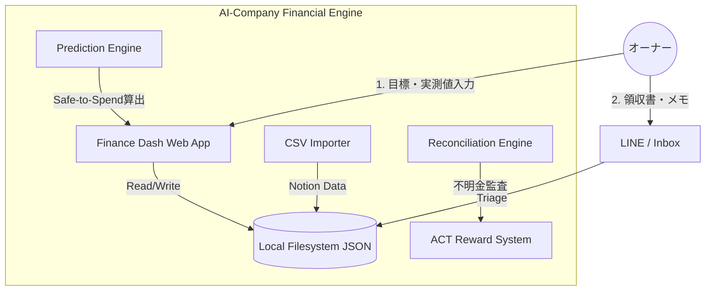

# 🏗️ 資産管理システム Phase 2：基本設計書 (Basic Design v2)

本設計は、最新の家計簿アプリ調査（2026-04-25）に基づき、単なる「記録ツール」から、行動経済学の知見を取り入れた「自律型金融エージェント」へと進化させるものである。

## 1. システム構成図

## 2. コア設計思想 (Core Philosophy)

### 2.1 行動経済学に基づくUX (Behavioral Economics)
- **記録から意思決定へ**: 1円単位の修正に疲弊する設計を排除。主要指標を「Safe-to-Spend（今、自由に使える金）」に集約。
- **認知的負荷の低減**: 支出カテゴリーを最小限（5つ程度）に抑え、大きな流れを俯瞰する。
- **忘れられる設計 (Set-it-and-forget-it)**: 月一回のCSVインポートと整合性監査のみで、長期的な資産推移が維持される。

### 2.2 プロアクティブな介入 (Active Intervention)
- **整合性監査 (Reconciliation)**: 論理残高と実測値の差分（不明金）を検出し、ACTポイントと連動させることで「家計のマインドフルネス」をゲーミフィケーション化。
- **給与監査**: 大阪市教員給与規定に基づき、控除額が適切かを自動検証する。

### 2.3 セキュリティ & プライバシー
- **Local-First / Zero-Knowledge**: 金融データを外部クラウドに預けず、ローカルJSONで管理。事実上の「ゼロ知識アーキテクチャ」を実現し、究極のプライバシーを保証。
- **パートナーシップ・レイヤー**: 将来的な家族共有を見据え、個人資産と共有資産の「論理的な境界線（Osidoriモデル）」をデータ構造レベルで考慮。

## 3. 技術スタック (Tech Stack)
- **Frontend**: Vite + HTML/JS/Vanilla CSS (Premium Design System)。
- **App Type**: PWA (Progressive Web App) - セキュアなローカル実行。
- **Data Persistence**: JSONファイル（AES-256暗号化対応可能）。
- **Logic**:
    - **UI Logic**: JavaScript (Dashboard UI)。
    - **Backend Logic**: Node.js (Local API) + Python (Advanced Analytics)。

## 4. UIコンセプト
- **Home**: 「あといくら使えるか（Safe-to-Spend）」と「純資産（Net Worth）」の巨大なインジケーター。
- **Audit**: 月末の実残高入力と、ACT付与/減算の演出。
- **Migration**: Notion CSVをドラッグ＆ドロップで取り込む「インポート・ターミナル」。

---
最終更新: 2026-04-25
設計者: Antigravity (v2)
