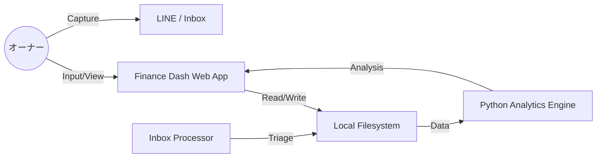

# 🏗️ 資産管理システム Phase 2：基本設計書 (Basic Design)

## 1. システム構成図



## 2. 技術スタック (Tech Stack)
- **Frontend**: Vite + HTML/JS/Vanilla CSS (Premium Design System)。
- **App Type**: PWA (Progressive Web App) - スマホのホーム画面にピン留め可能。
- **Data Persistence**: JSONファイル（`data/master/`, `data/records/`）。
- **Logic**:
    - **UI Logic**: JavaScript (Charts.js または D3.js による視覚化)。
    - **Backend Logic**: Node.js（ローカルサーバー）または Python スクリプト。

## 3. ディレクトリ構造
```
company/finance/
├── dashboard/          # Web App 実行環境
│   ├── index.html      # メインUI
│   ├── main.js         # フロントエンドロジック
│   └── style.css       # プレミアムデザイン
├── data/
│   ├── master/         # 資産マスター、給与規定等
│   ├── records/        # 月次支出明細、給与履歴
│   └── archive/        # 処理済みCSV等
├── scripts/            # 集計・監査エンジンのソース
└── specs/              # 仕様書・設計書
```

## 4. データ定義 (Data Schema)

### 4.1 支出レコード (Expense)
```json
{
  "id": "uuid",
  "date": "2026-04-21",
  "category": "食費",
  "amount": 1200,
  "source": "PayPay",
  "note": "昼食",
  "status": "confirmed"
}
```

### 4.2 給与明細レコード (Salary Slip)
```json
{
  "month": "2026-04",
  "basic_pay": 0,
  "allowances": { "transport": 0, "housing": 0 },
  "deductions": { "income_tax": 0, "health_insurance": 0 },
  "net_pay": 0,
  "audit_status": "verified"
}
```

## 5. UIコンセプト
- **Home**: 現在の Net Worth と今月の収支、翌日の予測。
- **Entry**: 高速入力ボタン群 + 給与明細専用トグル。
- **Analytics**: 支出ヒートマップ、資産推移グラフ（Notion比 3倍速）。

---
最終更新: 2026-04-21
設計者: Antigravity
