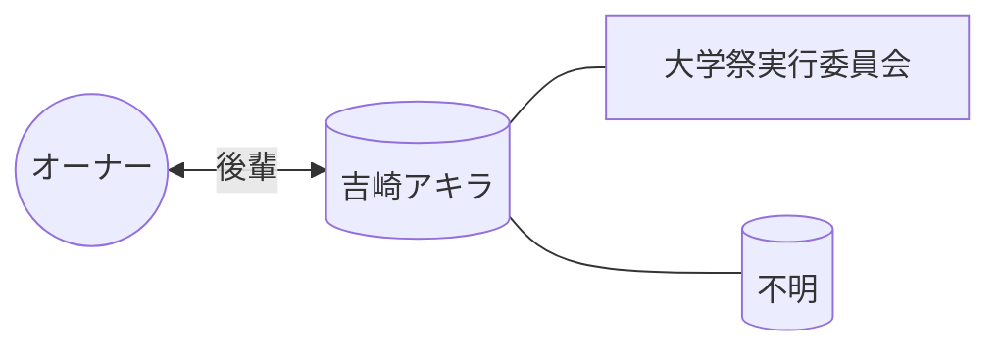

# 👤 吉崎アキラ

> [!ABSTRACT] プロファイル要約
> **【大学祭実行委員会 後輩】**
> オーナーの学生時代の活動を共にしたメンバー。

## 💎 スキル / 特性 (Obsidian-Skills)
- **現在の年齢**: 21歳 (2004年生まれ)
- **コミュニティ**: 大学祭実行委員会
- **活動拠点**: 不明

## 📖 関係性の歴史
- **出会い**: 大学祭実行委員会
- **時代**: 学生時代 (同期・後輩)

## 🔗 ネットワーク (Mermaid)

## 📜 LINEログからの知見 (Relation Analysis)
> [!TIP] 関係性の推定
> - **主要な呼び名**: ざき
> - **確認済み交流**: 29件のログメッセージ
> - **主要チャット**: 五月祭　打ち上げ🚀, 実委HP引き継ぎ用, 2024年度実委1･2･3回生ᐠ( ᐢᐤᐢ )ᐟ, 神奈川旅行（105〜6）, 4月6日　謎解き旅など

## 📝 ログ
- **2026-04-04**: メンバーリストより一括登録実施。
