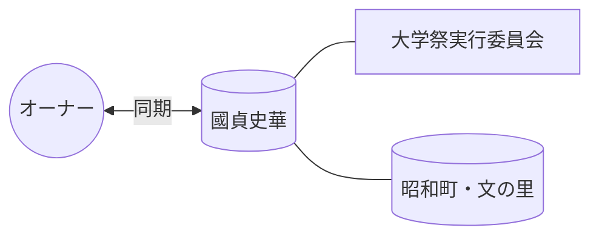

# 👤 國貞史華

> [!ABSTRACT] プロファイル要約
> **【大学祭実行委員会 同期】**
> オーナーの学生時代の活動を共にしたメンバー。

## 💎 スキル / 特性 (Obsidian-Skills)
- **現在の年齢**: 22歳 (2004年生まれ)
- **コミュニティ**: 大学祭実行委員会
- **活動拠点**: 昭和町・文の里

## 📖 関係性の歴史
- **出会い**: 大学祭実行委員会
- **時代**: 学生時代 (同期・後輩)

## 🔗 ネットワーク (Mermaid)

## 📝 ログ
- **2026-04-04**: メンバーリストより一括登録実施。
