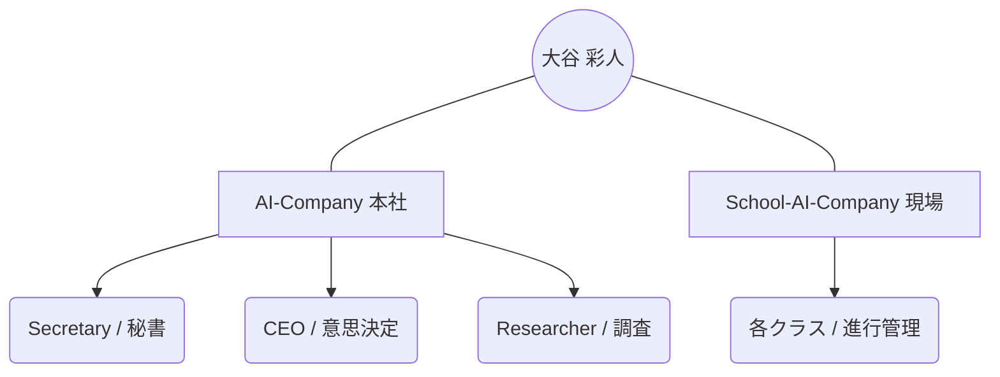

# 👤 大谷 彩人 (Saito Otani)

> [!ABSTRACT] プロファイル要約
> AI-Company / School-AI-Company の創設者兼 CEO。
> 「AIによる自己管理と能力拡張」を体現し、教職とITの架け橋となるパラレルキャリアを構築中。

## 💎 スキル & 専門性 (Obsidian-Skills)
- **Primary Skill**: `Education-DX` (ICT教育、教職ハック)
- **Secondary Skills**: `AI-Management`, `Web-Development`, `Project-Management`
- **興味・関心**: `Generative AI`, `Productivity Systems`, `Educational Technology`

## 🤝 コミュニケーション & 特性
- **性格**: 実利と成長を重視する戦略的思考。論理的かつ親しみやすい指導力。
- **スタイル**: 効率的なテキストコミュニケーションを好み、自動化・システム化を徹底する。
- **ビジョン**: 3年以内のIT/DX転職を成功させ、市場価値を最大化する。

## 📖 キャリア・ステータス
- **現職**: 大阪市立本田小学校（教諭）
- **経歴**: 
    - 2026.04 - 現在: 教育公務員
    - 2022 - 2026: 大阪教育大学、塾講師、大学DXスタッフ
    - 2025.10 - 2026.03: Google AIアンバサダー
- **主要な実績**: 
    - [x] 大学での統計学指導（R言語支援）
    - [x] AI-Company 組織構築と運用
    - [x] メンバー管理システム（Line Log Integration）の主導

## 🔗 組織ネットワーク (Mermaid)

## 📝 最新ログ
- **2026-05-01**: HR（人事部）に対し、自身のプロファイル作成を指示。組織内の全メンバーと並び、オーナーとしての立ち位置を明確化した。
- **2026-04-30**: SAC（現場）への印刷物データ作成およびクラス進捗管理を指示。

## 💡 秘書メモ / ネクストアクション
- [ ] IT資格（Oracle, AWS等）の取得ロードマップの具体化
- [ ] School-AI-Company における「授業進捗・宿題管理システム」の印刷物データ整理
- [ ] Google Calendar 認証の再接続とデイリースケジュールの最適化
