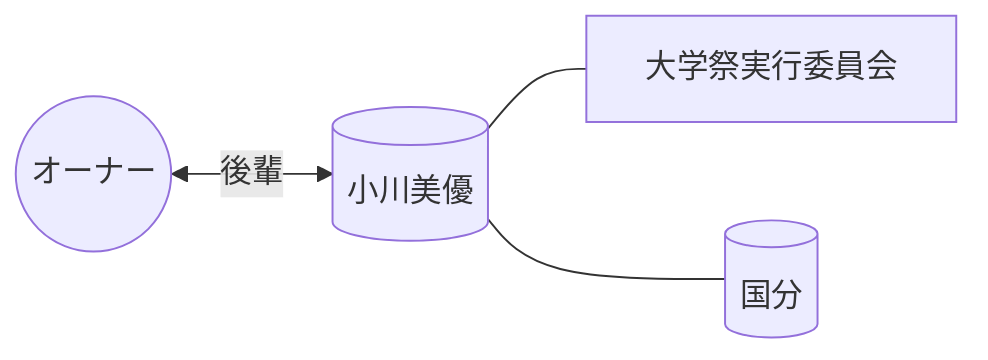

# 👤 小川美優

> [!ABSTRACT] プロファイル要約
> **【大学祭実行委員会 後輩】**
> オーナーの学生時代の活動を共にしたメンバー。

## 💎 スキル / 特性 (Obsidian-Skills)
- **現在の年齢**: 21歳 (2005年生まれ)
- **コミュニティ**: 大学祭実行委員会
- **活動拠点**: 国分

## 📖 関係性の歴史
- **出会い**: 大学祭実行委員会
- **時代**: 学生時代 (同期・後輩)

## 🔗 ネットワーク (Mermaid)

## 📜 LINEログからの知見 (Relation Analysis)
> [!TIP] 関係性の詳細
> - **愛称**: みゆ, 心優
> - **役割**: PA担当（音響・照明）。オーナーからの信頼が厚く、神霜祭などの大規模イベントでは「ステージ番」としてイレギュラーな事態にも的確に対応する。
> - **交流頻度**: 非常に高く、実委・PA関連のグループで頻繁に連携している。

## 📝 ログ
- **2026-04-04**: メンバーリストより一括登録実施。
