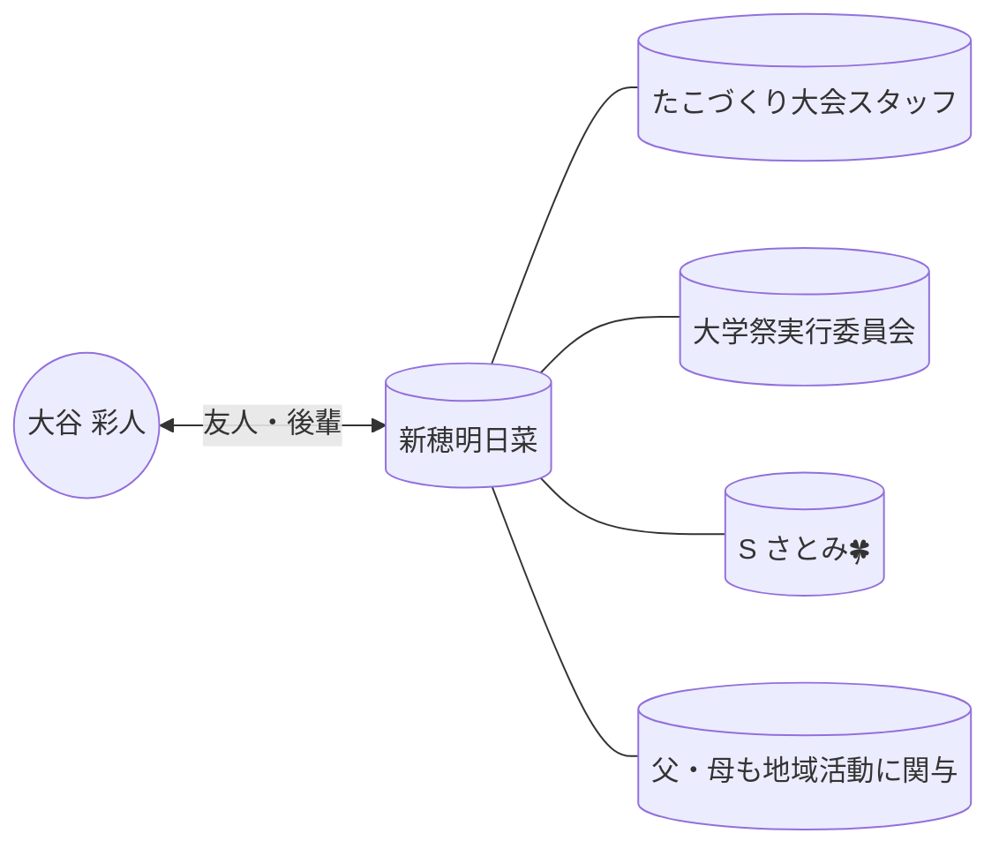

# 👤 新穂明日菜

> [!ABSTRACT] プロファイル要約
> 大学祭実行委員会やたこづくり大会のスタッフとして活動。事務処理能力が非常に高く、チラシ作成や議事録作成を迅速にこなす。現在は大学4年生で、ストレスコーピングに関する卒業論文を執筆中。

## 💎 スキル & 専門性 (Obsidian-Skills)
- **Primary Skill**: `地域イベント運営・企画`
- **Related Skills**: `ドキュメント作成 (チラシ・議事録)`, `事務作業`, `心理学調査`
- **興味・関心**: `教育`, `心理学 (ストレスコーピング)`, `地域活動`

## 🤝 コミュニケーション & 特性
- **性格**: 非常に責任感が強く、仕事が早い。丁寧で協力的な姿勢が周囲から高く評価されている。
- **コミュニケーション・スタイル**: LINE中心。要件を明確に伝え、迅速なレスポンスを行う。
- **好きなもの (ギフト候補)**: 不明（実用的なものやダイソーの便利グッズなどに詳しい可能性あり）

## 📖 関係性の歴史
- **出会い**: 大学祭実行委員会、または地域のたこづくり大会スタッフ。
- **主要なイベント**:
    - [x] 2024年度 たこづくり大会スタッフ（チラシ・プログラム作成、議事録担当）
    - [x] 2025-04-24 卒論アンケート（ストレスコーピング）の協力依頼
- **現在のステータス**: 卒論の調査協力などを通じて交流あり。

## 🔗 ネットワーク (Mermaid)

## 📝 最新ログ
- **2025-04-24**: 卒業論文「ストレスコーピング」のアンケート協力依頼をLINEで受領。男子大学生の回答データを集めており、友人への展開も依頼された。
- **2024-11〜2025-01**: たこづくり大会の企画委員として、プログラムシートの整備や案内チラシの作成をリード。父親から過去のデータを取り寄せるなど、主体的に動いていた。

## 💡 秘書メモ / ネクストアクション
- [ ] 卒論の進捗や就職活動の状況について機会があれば尋ねる。
- [ ] 地域イベントで事務的な協力が必要な際、非常に頼りになる人物。
