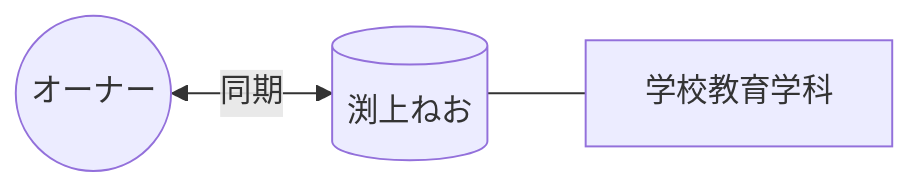

# 👤 渕上ねお

> [!ABSTRACT] プロファイル要約
> **【学校教育学科 同期】**
> オーナーと同じ学校教育学科に所属する大学の同期。
> 11月5日が誕生日。

## 💎 スキル / 特性 (Obsidian-Skills)
- **現在の年齢**: 22歳 (2003年生まれ)
- **コミュニティ**: 大学（学校教育学科）

## 📖 関係性の歴史
- **出会い**: 大学（学内）
- **時代**: 学生時代 (同期)
- **活動**: 講義、学科内での交流

## 🔗 ネットワーク (Mermaid)

## 📜 LINEログからの知見 (Relation Analysis)
> [!TIP] 関係性の詳細
> - **愛称**: ねお
> - **背景**: 学科内の親しい同期として、誕生日などのイベントで交流。

## 📝 ログ
- **2026-04-15**: 新規登録。ニックネーム「ねお」と実名「渕上まほ」を紐付け。
