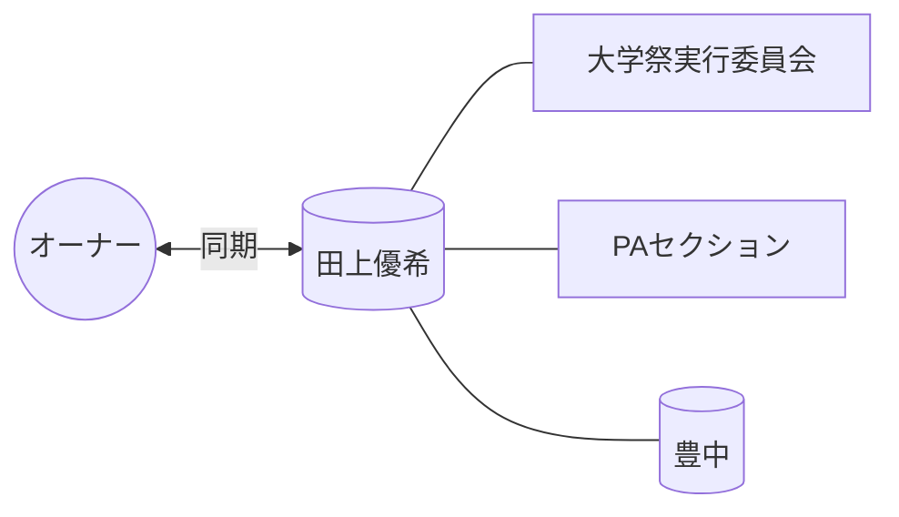

# 👤 田上優希

> [!ABSTRACT] プロファイル要約
> **【大学祭実行委員会 (PA) 同期】**
> オーナーと共に大学祭実行委員会のPAセクションで活動したメンバー。

## 💎 スキル / 特性 (Obsidian-Skills)
- **現在の年齢**: 22歳 (2003年生まれ)
- **コミュニティ**: 大学祭実行委員会 (PAセクション)
- **活動拠点**: 豊中

## 📖 関係性の歴史
- **出会い**: 大学祭実行委員会
- **時代**: 学生時代 (同期)
- **活動**: PA現場での連携、同期会等での交流

## 🔗 ネットワーク (Mermaid)

## 📜 LINEログからの知見 (Relation Analysis)
> [!TIP] 関係性の詳細
> - **愛称**: ゆうき
> - **背景**: 2月12日会等の同期グループとも深い関わりを持ち、PAセクションの主力メンバーとして活動。

## 📝 ログ
- **2026-04-04**: メンバーリストより一括登録実施。
- **2026-04-15**: ニックネーム「ゆうき」との紐付けとPA情報の統合。
