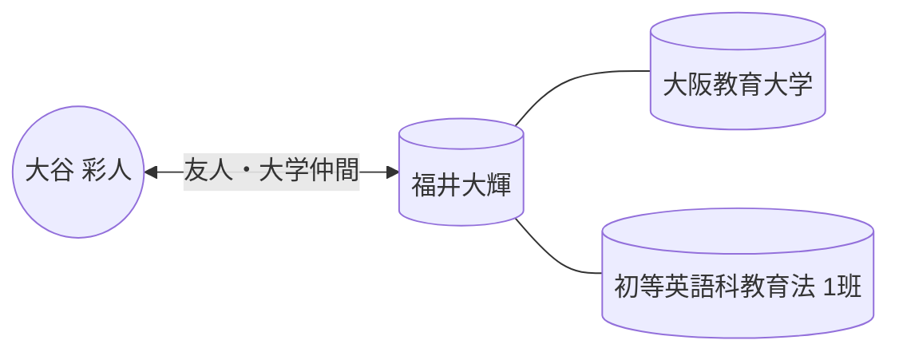

# 👤 福井大輝

> [!ABSTRACT] プロファイル要約
> 大阪教育大学の同級生。「初等英語科教育法」のグループワーク（1班）で共に活動。

## 💎 スキル & 専門性 (Obsidian-Skills)
- **Primary Skill**: `教育学`
- **Related Skills**: `英語教育`
- **興味・関心**: `学校教育`

## 🤝 コミュニケーション & 特性
- **性格**: 協力的な学生仲間
- **コミュニケーション・スタイル**: LINEグループでのやり取りが中心
- **好きなもの (ギフト候補)**: 不明

## 📖 関係性の歴史
- **出会い**: 大阪教育大学の授業（初等英語科教育法）
- **主要なイベント**:
    - [x] 2024年度 初等英語科教育法 1班グループワーク
- **現在のステータス**: 授業関連のグループLINEに所属

## 🔗 ネットワーク (Mermaid)

## 📝 最新ログ
- **2024-10-25**: 「初等英語科教育法(1班)」のLINEグループに参加。星野慎太朗を招待するなど、グループの立ち上げに関与。

## 💡 秘書メモ / ネクストアクション
- [ ] 授業や試験関連での情報交換があれば記録する。
