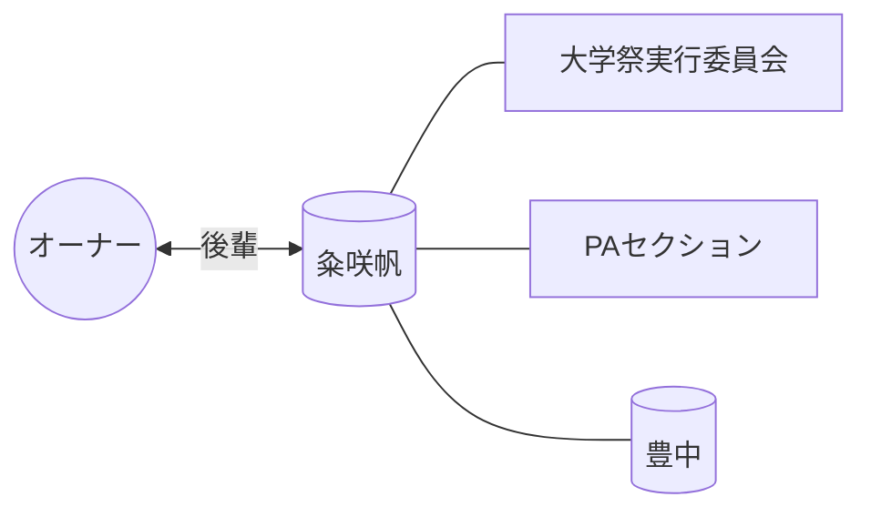

# 👤 粂咲帆

> [!ABSTRACT] プロファイル要約
> **【大学祭実行委員会 (PA) 後輩】**
> オーナーと共に大学祭実行委員会のPAセクションで活動したメンバー。
> 12月7日が誕生日。

## 💎 スキル / 特性 (Obsidian-Skills)
- **現在の年齢**: 21歳 (2004年生まれ)
- **コミュニティ**: 大学祭実行委員会 (PAセクション)
- **活動拠点**: 豊中

## 📖 関係性の歴史
- **出会い**: 大学祭実行委員会
- **時代**: 学生時代 (後輩)
- **活動**: PA業務のオペレーション、機材管理など

## 🔗 ネットワーク (Mermaid)

## 📜 LINEログからの知見 (Relation Analysis)
> [!TIP] 関係性の詳細
> - **愛称**: さきほ
> - **背景**: PAセクションの重要な後輩として、現場での連携ログが多数確認されている。
> - **注意**: ニックネーム「iroha」とは別人と判断。

## 📝 ログ
- **2026-04-04**: メンバーリストより一括登録実施。
- **2026-04-15**: ニックネーム「さきほ」との紐付けとプレミアム化を実施。
