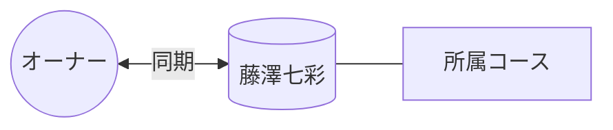

# 👤 藤澤七彩

> [!ABSTRACT] プロファイル要約
> **【所属コース 同期】**
> オーナーと同じコースに所属する大学の同期。
> 大学祭実行委員会などの委員会活動には所属していない。
> 12月2日が誕生日。

## 💎 スキル / 特性 (Obsidian-Skills)
- **現在の年齢**: 23歳 (2003年生まれ)
- **コミュニティ**: 大学（所属コース同期）

## 📖 関係性の歴史
- **出会い**: 大学（学内）
- **時代**: 学生時代 (同期)
- **活動**: 講義、コース内での交流

## 🔗 ネットワーク (Mermaid)

## 📜 LINEログからの知見 (Relation Analysis)
> [!TIP] 関係性の詳細
> - **愛称**: ななせ
> - **背景**: 委員会メンバーではないが、コース内の主要な友人として交流。

## 📝 ログ
- **2026-04-05**: 1次名寄せ実施（ななせ → 藤澤七彩）。
- **2026-04-15**: 誤情報の修正。委員会所属情報を削除し、同期としての関係性に訂正。
