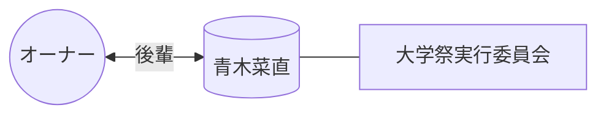

# 👤 青木菜直

> [!ABSTRACT] プロファイル要約
> **【大学祭実行委員会 後輩】**
> オーナーの学生時代の活動を共にした実行委員会のメンバー。
> 8月17日が誕生日。

## 💎 スキル / 特性 (Obsidian-Skills)
- **現在の年齢**: 21歳 (2004年生まれ)
- **コミュニティ**: 大学祭実行委員会

## 📖 関係性の歴史
- **出会い**: 大学祭実行委員会
- **時代**: 学生時代 (後輩)
- **活動**: パンフレットの挟み込み、各祭典の準備業務など

## 🔗 ネットワーク (Mermaid)

## 📜 LINEログからの知見 (Relation Analysis)
> [!TIP] 関係性の詳細
> - **愛称**: なお
> - **背景**: 委員会内での実務的なやり取りや、誕生日のお祝い等の交流が確認されている。

## 📝 ログ
- **2026-04-04**: メンバーリストより一括登録実施。
- **2026-04-15**: ニックネーム「なお」との紐付けを反映。
