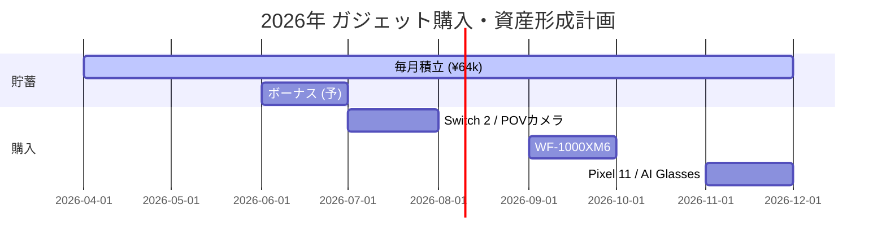

# 📈 資産管理ダッシュボード (2026 Q2)

## 💰 資産概況 (2026年3月末時点)
| 項目 | 金額 | 備考 |
| :--- | :--- | :--- |
| **総資産** | **¥377,600** | 前月比 +\46,000 |
| 投資可能余力 | ¥150,000 | 生活防衛資金(20万)を除いた額 |
| 貯蓄率 | 25.8% | 目標 20% 以上 |

---

## 🎯 財務目標 2026
1. **ガジェット積立**: **¥540,000** (2026年12月までに確保)
2. **生活防衛資金**: **¥600,000** (半年分の生活費)
3. **つみたてNISA/投資**: 月額 ¥30,000 開始

---

## 📅 購入・積立ロードマップ

---

## 🔗 関連リンク
- [[wishlist_2026|🛍️ 2026年ガジェット・ウィッシュリスト]]
- [[2026-03|📊 2026年03月 収支詳細]]

---
*Created by AI-Company Lifestyle Dept.*
