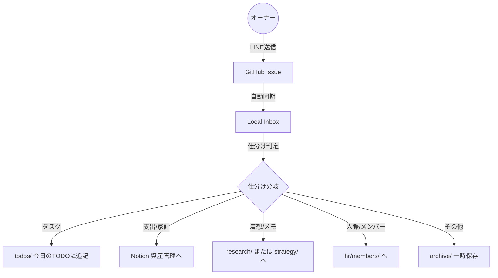

# 📥 インボックス処理・プロトコル (INBOX_WORKFLOW)

## 1. 処理フロー (The Flow)

## 2. 仕分けタグの定義 (Prefixes)
LINEで送信する際、以下のプレフィックスを付けることで、私の自動処理精度が向上します。

| プレフィックス | 分類 | 処理内容 |
| :--- | :--- | :--- |
| **[T]** または **[TASK]** | タスク | `todos/2026-xx-xx.md` の「通常タスク」セクションに追記。 |
| **[E]** または **[EXP]** | 支出 | 資産管理Notionにレコード作成、または `finance/` ログに追記。 |
| **[I]** または **[IDEA]** | アイデア | `company/research/topics/` に新規ノートを作成、または既存ノートに追記。 |
| **[M]** または **[MEMO]** | 備忘録 | `secretary/notes/` へ格納。 |

※ プレフィックスがない場合は、私が内容を文脈から判断し、確認の上で振り分けます。

## 3. 実行タイミング (When to Execute)

### A. 定期実行 (Standard)
- **`/sync_session` (夜の同期)**: 
  - 本日のインボックスを全件確認し、適切な部署への振り分けを完了させる。
  - 振り分け済みの項目は `inbox/YYYY-MM-DD.md` 内で `[x]` をつける。

### B. オンデマンド実行 (On-demand)
- **`/inbox_triage` (仮)**: 
  - 外出先から戻った直後など、即座に整理したい場合に呼び出す。

---
作成日: 2026-04-21
ステータス: 運用開始
