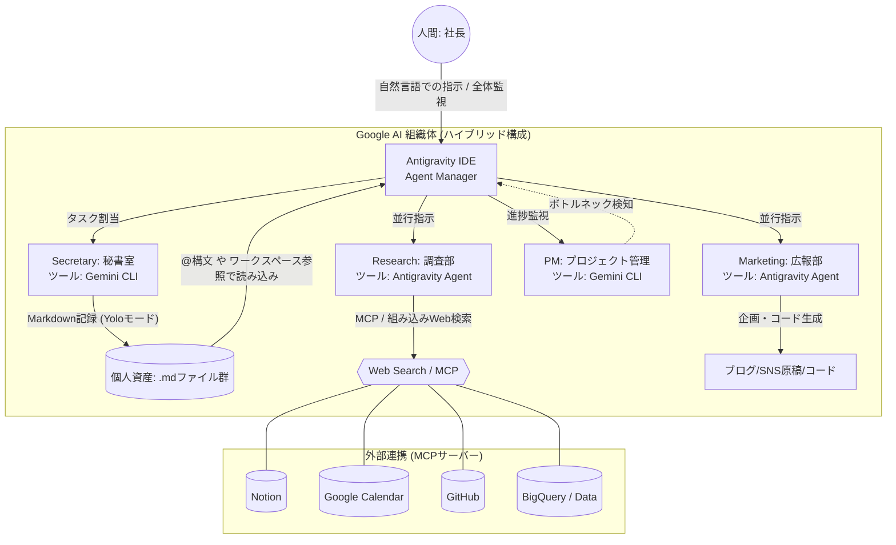

専門家として、ご提示いただいた「AIカンパニー・モデル」のアーキテクチャを評価し、Googleのツール群（Antigravity IDE および Gemini CLI）を用いてどのように再現、あるいはそれ以上に昇華できるかを解説します。

まず、**批判的な視点**から申し上げます。動画内で紹介されている「Claude Codeを用いてターミナル上でディレクトリを移動しながら各部署（AI）に指示を出す」という手法は、直感的ではありますが、システム工学的には**非効率**です。これは例えるなら「社長自らが各部署の部屋（ディレクトリ）に直接足を運んで、1つずつ口頭で指示を出して回っている状態」に他なりません。AIエージェントの真価は「自律性」と「並行処理」にあります。

この課題を克服し、より高度な「AI組織」を構築するために、**Google Antigravity IDEの「Agent Manager」による並列オーケストレーション**と、**Gemini CLIの「ヘッドレス実行・Yoloモード」**を組み合わせたハイブリッド型のアーキテクチャを提案します。

---

### 1. Google環境での「AIカンパニー」実装方針

動画の構成要素をGoogleのツール群に置き換え、さらに最適化します。

* **基盤ツール1: Google Antigravity IDE (社長のダッシュボード / CEO室)**
* **役割:** 会社全体の管理、エージェントの並行稼働、コードや生成物の視覚的確認。
* **機能の代替:** 複数のエージェントを同時に立ち上げて監視できる「Agent Manager（Mission Control）」機能を使用します。これにより、ターミナルを移動することなく、調査部と広報部を同時に動かすことが可能です。
* **ルールの定義:** Claudeの `CLAUDE.md` の代わりに、各ディレクトリ（部署）に **`SKILL.md`**（Antigravityのカスタムスキル定義ファイル）を配置し、各エージェントの役割とプロンプトを定義します。

* **基盤ツール2: Gemini CLI (実務担当 / バックグラウンド処理)**
* **役割:** ターミナルでの高速なファイル操作、バッチ処理、定期実行タスク。
* **機能の代替:** Yoloモードによるシェルコマンド実行機能と、特定のファイルを即座にコンテキストとして読み込む `@ファイル名` 構文を活用します。秘書（Secretary）や進捗管理（PM）など、見えないところで動くバックグラウンド業務に最適です。

* **外部連携:** * AntigravityとGemini CLIは共に **MCP (Model Context Protocol) サーバー** をネイティブサポートしています。NotionやGoogleカレンダーへの接続は、そのまま完全に再現可能です。

### 2. 再設計されたシステム構成図

上記のツール特性を活かし、人間（社長）のボトルネックを排除した構成図です。

### 3. 各部署（ディレクトリ）の具体的な動作プロセス

ハイブリッド環境下でのワークフローは以下のようになります。

1. **インプットとコンテキスト共有 (CEO & Secretary)**
* 人間がAntigravityのチャットインターフェースから「今日のトレンドを調べて記事案を作って」と指示を出します。
* Gemini CLIがバックグラウンドで起動し（Secretary役）、過去の `.md` ファイルを `@` 構文で高速に読み込み、社長の現在の思考コンテキストを整理して一時ファイルに出力します。

2. **並行リサーチと分析 (Research)**
* AntigravityのAgent Manager上で、Researchディレクトリ（`SKILL.md`で「あなたは調査員です」と定義済み）のエージェントが起動します。
* MCPを経由してWeb検索やNotionの過去データを漁り、要約レポートを作成します。

3. **コンテンツ生成 (Marketing)**
* Researchのレポート生成とほぼ同時に、あるいは完了をトリガーとして、Marketingエージェントが起動します。レポートを読み込み、ブログ記事やSNSの投稿案を生成します。

4. **自動ファイル書き込みとPM**
* 生成されたコンテンツは、Gemini CLIのYoloモード（ファイル書き込み権限あり）によって所定のフォルダにMarkdownとして保存されます。

### 4. この実装形態の技術的な核（メリット）

* **「移動」からの脱却:** Antigravityのダッシュボード一つで全エージェントの稼働状況を俯瞰できるため、ディレクトリ間のコンテキストの断絶を防げます。
* **ヘッドレスとUIの使い分け:** 「人間が確認しながら進めるべきクリエイティブな作業（Marketing）」はAntigravityのIDE上で、「定型的なファイル操作や記録（Secretary）」はGemini CLIのヘッドレス実行で行うという、適材適所の運用が可能です。

---

この設計図と方針で問題なければ、次のステップとして**「環境構築（インストールからMCPの設定まで）」および「各ディレクトリへのSKILL.mdの記述と動作テスト」の具体的な再現手順**の策定に入ります。いかがでしょうか？